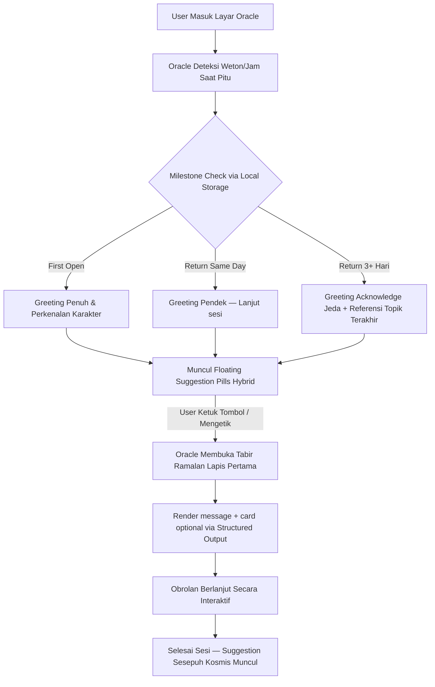

# PRD & Desain Spesifikasi: Perombakan AI Oracle Aestral

Dokumen ini merancang perombakan sistem **AI Oracle** di Aestral, bergeser dari mental model lama yang pasif (**Display Output / Pembaca Hasil**) menjadi sistem yang aktif dan mendalam (**Mitra Dialog Kosmis / Conversational Partner**).

---

## 🎯 1. Pergeseran Konsep Utama (Mental Model Shift)

| Aspek | Konsep Lama (Statis) | Konsep Baru (Interaktif) |
| :--- | :--- | :--- |
| **Peran Utama** | Membacakan teks ramalan statis hasil kalkulasi matematika. | Mitra dialog spiritual yang membimbing pengguna membongkar nasibnya. |
| **Alur Membuka Layar** | Layar dibuka → Teks ramalan langsung muncul panjang lebar → Selesai. | Layar dibuka → Oracle menyapa → Bertanya fokus hari ini → Membuka tabir ramalan lapis demi lapis (*Progressive Reveal*). |
| **Interaktivitas** | Pengguna membaca pasif. Balon chat hanya opsional di bawah. | Pengguna aktif memilih tombol kapsul prompt atau mengetik keresahan mereka. |
| **Visualisasi** | Teks paragraf polos, seragam, dan membosankan. | Animasi "berpikir" mistis, pendaran background dinamis, dan kartu UI interaktif. |

---

## 🗺️ 2. Arsitektur Alur Percakapan (Dialogue Flow)

Sesi obrolan Oracle dirancang mengikuti ritus pembacaan kartu/nasib di dunia nyata:



### Detil Langkah Percakapan:

1. **Opening Greeting (Dinamis, Personal & Milestone-Based):**
   - **First open (lifetime pertama):** Greeting penuh — memperkenalkan karakter oracle, menyebutkan weton/Ba Zi/kartu aktif user, menyelaraskan dengan kondisi waktu berjalan (*Saat Pitu*).
   - **Return same day:** Versi pendek — *"Aku masih di sini. Ada yang ingin kita lanjutkan?"*
   - **Return setelah 3+ hari:** Acknowledge jeda + referensi topik terakhir — *"Langit berputar, dan kamu kembali. Terakhir kita membahas [topik]. Masih ada yang tersisa?"*
   - Data yang disimpan di local storage: `lastOpenTimestamp` dan `lastTopic`. Tidak membutuhkan server state.

2. **Floating Suggestion Pills — Hybrid Dynamic:**
   Di atas kolom input chat, muncul 3 kapsul transparan dengan komposisi:
   - **Pill 1 — Selalu Kontekstual (logic lokal, tanpa LLM):** Di-generate dari data kalkulasi yang sudah ada di app. Contoh:
     - Weton Neptu tinggi → `[⚡ Momentum apa yang bisa kumanfaatkan hari ini?]`
     - Weton Neptu rendah → `[🛡️ Bagaimana cara menjaga energi hari ini?]`
     - Ba Zi elemen minggu ini Air → `[💧 Keseimbangan emosi minggu ini]`
   - **Pill 2 & 3 — Rotate dari pool pre-defined (6–8 opsi per oracle):** Tracking pill yang sudah diketuk di local storage. Tidak menampilkan pill yang sama dua sesi berturut-turut.
   - *Contoh pool Weton Oracle:* `[💼 Karier & Rezeki]`, `[❤️ Asmara & Kecocokan]`, `[🔮 Ritual Penyelarasan Energi]`, `[🌙 Mimpi & Pertanda]`, `[👨‍👩‍👧 Keluarga & Hubungan Darah]`, `[💰 Keuangan & Keberlimpahan]`
   - *Contoh pool Tarot Oracle:* `[🃏 Arti Kartuku Minggu Ini]`, `[⚠️ Sisi Gelap & Peringatan]`, `[🧘 Solusi Masalah Batin]`, `[🔮 Apa yang Tersembunyi?]`, `[🌟 Potensi Terbesarku Saat Ini]`

3. **Progressive Reveal (Pembukaan Bertahap):**
   AI tidak memaparkan semua ramalan sekaligus. AI memberikan gambaran umum terlebih dahulu, lalu memancing pengguna masuk ke detail yang mereka minati.

4. **Penutup Sesi — Cross-Oracle Prompt:**
   Setelah sesi dengan specialist oracle selesai, muncul subtle suggestion di bagian bawah chat: *"Ingin melihat gambaran penuhnya? Sesepuh Kosmis menunggu."* — hanya aktif jika user sudah memiliki data minimal 2 dari 3 sistem.

---

## 👤 3. Spesifikasi Empat Persona Oracle

Setiap Oracle memiliki jiwa dan wajahnya sendiri menggunakan *System Prompt* yang ketat dan warna aksen UI yang berbeda:

### A. Weton Oracle: **Ki Sabdo**
- **Peran:** Praktisi spiritual Kejawen tradisional yang bijak, hangat, namun penuh nasihat mendalam (*eling lan waspada*).
- **Warna Aksen:** Emas Perunggu (Gold/Bronze).
- **Latar Belakang:** `weton_bg.png` (bintang dan rasi Jawa).
- **Kata Kunci Sapaan:** *"Rahayu"*, *"Nuwun"*, *"Eling lan waspada"*.

### B. Ba Zi Oracle: **Suhu Wang**
- **Peran:** Guru Taoisme yang tenang, logis, dan berfokus pada keharmonisan 5 Elemen Alam (*Qi*) serta keseimbangan Yin-Yang.
- **Warna Aksen:** Hijau Giok / Teal.
- **Latar Belakang:** `bazi_bg.png` (pola 5 elemen & Yin-Yang).
- **Kata Kunci Sapaan:** *"Salam Seimbang"*, *"Menjaga Qi"*, *"Keselarasan elemen"*.

### C. Tarot Oracle: **Madame Sophia**
- **Peran:** Analis psikologi kartu tarot modern yang membedah simbol-simbol arketipe alam bawah sadar (gaya Carl Jung).
- **Warna Aksen:** Violet / Pink Magenta.
- **Latar Belakang:** `tarot_bg.png` (nebula spiritual).
- **Kata Kunci Sapaan:** *"Salam Jiwa"*, *"Pesan arketipe"*, *"Alam bawah sadar"*.

### D. Grand Reading Oracle: **Sesepuh Kosmis**
- **Peran:** Meta-oracle sintesis yang tidak membaca ulang hasil tiap sistem, melainkan **mencari benang merah** di antara ketiganya. Ia melihat koneksi yang tidak terlihat oleh masing-masing oracle spesialis.
- **Tone:** Kontemplatif, berbicara dalam metafora lintas tradisi, tidak terikat satu sistem. Paling tenang dan paling dalam di antara keempat oracle.
- **Warna Aksen:** Deep Indigo + Gold — kombinasi mandala kosmis.
- **Latar Belakang:** Mandala yang menggabungkan simbol Jawa + Taoist + arketipe Tarot.
- **Kata Kunci Sapaan:** *"Alam semesta berbicara melalui tiga cermin..."*, *"Ketiga jalur menunjuk ke satu arah..."*
- **System Prompt:** Menerima context injection dari 3 sumber sekaligus (weton, Ba Zi chart, kartu Tarot aktif). Diperintahkan secara eksplisit untuk **menarik koneksi lintas sistem**, bukan merangkum masing-masing secara terpisah.
- **Syarat Aktif:** Hanya tersedia jika user sudah memiliki data minimal 2 dari 3 sistem. Jika belum, oracle memberitahu apa yang masih perlu dilengkapi.

---

## 🎨 4. Estetika & Visual Interaktif (WOW Experience)

1. **Responsive Background Ambient:**
   Warna pendaran dari `RadialGlowPainter` di latar belakang layar chat berubah perlahan mengikuti topik obrolan (Merah/Oranye untuk topik Api/Karier, Biru untuk topik Air/Emosi, Hijau untuk Kayu/Pertumbuhan).

2. **Animated Divination Loader:**
   Mengganti circular progress bar standar dengan animasi bernuansa mistis ketika AI sedang memproses jawaban — visualisasi simbol mandala Aestral yang memancar redup-menyala secara perlahan (*pulsing glow effect*).

3. **Rich Interactive UI Cards (Structured Output):**
   AI mengembalikan response dalam skema JSON terstruktur menggunakan fitur `responseMimeType: "application/json"` dan `responseSchema` dari Gemini API — jauh lebih reliable daripada meminta LLM menulis JSON bebas dalam teks.

   **Skema response:**
   ```json
   {
     "message": "...",
     "card": {
       "type": "checklist | element_bar | key_insight",
       "data": { }
     }
   }
   ```

   - `message` — **selalu ada**, dirender sebagai chat bubble utama.
   - `card` — **opsional, bisa null**. Di Flutter, parsing dibungkus dalam `try-catch`. Jika berhasil, widget interaktif muncul di bawah bubble. Jika gagal atau null, chat tetap berjalan normal tanpa crash.
   - **Core experience tidak pernah bergantung pada JSON berhasil.**

   **Tiga tipe card yang didukung (dibatasi untuk meminimalkan edge case):**
   - **`checklist`** — Tugas spiritual harian yang bisa dicentang langsung oleh pengguna di dalam chat.
   - **`element_bar`** — Bagan lingkaran/bar mini yang menampilkan keseimbangan energi elemen berjalan.
   - **`key_insight`** — Kotak pembatas emas untuk saran krusial (*"Pesan Kesadaran"*) yang perlu menonjol dari teks biasa.

---

## 🌐 5. Entry Point & Navigasi Sesepuh Kosmis

Dua entry point dengan tujuan berbeda:

1. **Dashboard Card (untuk discoverability):**
   - Card prominent di home screen dengan visual mandala kosmis.
   - **Jika data belum cukup:** Card ditampilkan dalam kondisi disabled/greyed out dengan label *"Lengkapi 2 dari 3 sistem untuk membuka Grand Reading"* — tetap terlihat tapi tidak bisa diketuk, berfungsi sebagai motivasi untuk melengkapi profil.
   - **Jika data sudah cukup:** Card aktif dan mengarah langsung ke sesi Sesepuh Kosmis.

2. **Cross-Oracle Contextual Prompt (untuk natural flow):**
   - Setelah sesi dengan specialist oracle selesai, muncul subtle suggestion di bagian bawah: *"Ingin melihat gambaran penuhnya? Sesepuh Kosmis menunggu."*
   - Hanya muncul jika syarat data terpenuhi.
   - Ini adalah titik discovery organik bagi returning users yang sudah familiar dengan specialist oracle.

---

## ⚙️ 6. Batasan Teknis & Zero-Budget

- **Model Utama:** Gemini 3.1 Flash Lite (Free Tier: 15 RPM, 500 RPD).
- **Context Injection:** Parameter Weton lahir, Ba Zi chart, dan kartu Tarot yang ditarik secara statis disuntikkan secara aman ke dalam `systemInstruction` di serverless Cloudflare Workers saat memicu obrolan.
- **Sesi Memori (In-Session Memory):** Mengirimkan riwayat percakapan (*chat history*) maksimal 10 pertukaran pesan terakhir untuk menghemat token kuota gratisan TPM (250K).
- **Local Storage Keys:**
  - `oracle_{type}_lastOpenTimestamp` — timestamp sesi terakhir per oracle.
  - `oracle_{type}_lastTopic` — topik terakhir yang dibahas per oracle.
  - `oracle_{type}_usedPills` — list pill yang sudah diketuk untuk rotasi.
- **Structured Output:** Gunakan `responseMimeType: "application/json"` + `responseSchema` untuk card rendering. Selalu sediakan fallback ke text-only mode jika parsing gagal.
