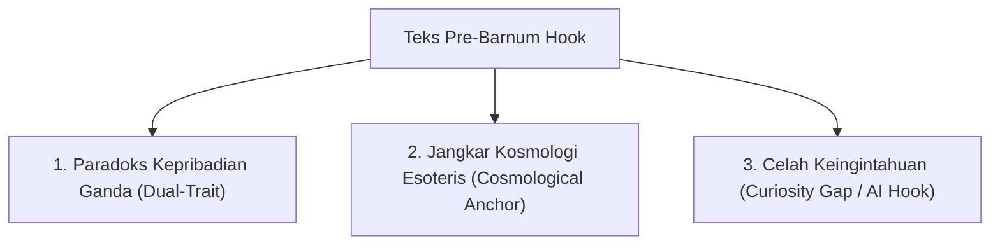

# Strategi Copywriting: Mengoptimalkan "Pre-Barnum Effect" untuk Konversi AI Chatbot

## 1. Mengapa Teks Saat Ini Gagal Menciptakan "Pre-Barnum Effect"?

Saat ini, teks dalam `kamus-weton.json`, `wuku.json`, dan interpretasi Tarot masih cenderung bersifat **Wikipedia-like (deskriptif satu arah)** atau **Direct/Sederhana (seperti ramalan kue keberuntungan)**. 
*   *Contoh teks sekarang:* "Kamu tipe pekerja yang suka memberi arahan... Dalam cinta kamu setia... Hati-hati dengan orang yang memanfaatkanmu."
*   *Masalah:* Teks ini terlalu hitam-putih, tidak memiliki kedalaman emosional, dan tidak menyentuh **sisi paradoks manusia**. Pengguna membacanya, berkata "oh oke", lalu menutup aplikasi karena tidak ada misteri atau rasa penasaran yang tersisa.

Agar pengguna tertarik berlangganan dan menggunakan **AI Chatbot (Konsultasi Interaktif)**, teks gratisan (statis) harus berfungsi sebagai **"Pre-Barnum Hook"**—sebuah pembacaan yang terasa sangat akurat dan personal, tetapi sengaja menyisakan **Curiosity Gap (celah rasa penasaran)** yang hanya bisa dijawab melalui diskusi dengan AI Chatbot.

---

## 2. Framework 3-Pillar Copywriting "Pre-Barnum" Aestral

Untuk menciptakan efek psikologis di mana pengguna merasa *"Aplikasi ini benar-benar tahu isi kepala saya yang paling dalam,"* setiap teks statis harus mengikuti tiga pilar berikut:



### Pillar 1: Paradoks Kepribadian Ganda (Dual-Trait Paradox)
Manusia adalah makhluk yang penuh kontradiksi. Barnum effect paling kuat bekerja ketika kita menyandingkan dua sifat yang berlawanan (eksternal vs. internal).
*   *Pola:* "Di luar Anda terlihat `[Sifat Eksternal/Kuat]`, namun secara rahasia di dalam Anda sering menyimpan `[Keraguan/Kerapuhan Internal]`."
*   *Efek:* Hampir 99% orang merasa ini sangat akurat karena semua orang menutupi keraguan mereka dengan topeng sosial.

### Pillar 2: Jangkar Kosmologi Esoteris (Esoteric Anchoring)
Menghubungkan istilah kuno Jawa (*Aura Geni, Sisa Bagi Pati, Sengkolo, Neptu*) dengan istilah psikologi/wellness modern (*burnout, emotional sponge, imposter syndrome, boundaries*). Ini membuat aplikasi terasa **otentik secara mistis** namun **relevan secara psikologis**.

### Pillar 3: Celah Keingintahuan (Curiosity Gap & AI CTA)
Teks statis mendiagnosis *masalah* dan *karakter*, tetapi **tidak memberikan solusi instan**. Di akhir teks, selalu diselipkan satu pertanyaan retoris/pemicu yang mengarahkan mereka untuk menanyakannya ke AI Chatbot.

---

## 3. Perbandingan Sebelum & Sesudah (Upgrade Contoh Data)

### A. Weton Kelahiran (Contoh: Minggu Legi)
*   **Sebelum (Flat):**
    > *"Kamu tipe pekerja yang suka memberi arahan. Dalam cinta kamu setia namun cenderung mengatur. Hati-hati dengan orang yang memanfaatkanmu."*
*   **Sesudah (Barnum Hook + AI CTA):**
    > *"Sebagai Minggu Legi (Si Penasihat Bijak), Anda memancarkan aura mengayomi yang membuat orang lain nyaman bersandar pada Anda. Namun secara rahasia, Anda sering memikul beban mental sendirian karena merasa tidak ada orang yang cukup kuat untuk mendengarkan keluh kesah Anda. Anda pandai membaca arah hidup orang lain, tetapi sering merasa tersesat saat menentukan langkah pribadi Anda sendiri.*
    > 
    > *💬 **Tanyakan pada AI Astrolog:** 'Mengapa weton saya membuat saya sulit menerima nasihat orang lain, dan bagaimana menyeimbangkan elemen saya?'"*

### B. Wuku Mingguan (Contoh: Wuku Sinta)
*   **Sebelum (Wikipedia-style):**
    > *"Minggu yang tepat untuk mengambil kendali proyek. Visi dan ketegasanmu sedang berada di puncaknya. Tetap dengarkan masukan tim agar eksekusi berjalan tanpa hambatan."*
*   **Sesudah (Barnum Hook + AI CTA):**
    > *"Di bawah naungan Wuku Sinta (Sang Visioner), energi kepemimpinan Anda minggu ini sedang menyala tajam. Anda merasa didorong untuk mengambil keputusan besar. Tetapi waspadalah, dorongan ini berisiko memicu kecemasan tersembunyi (*imposter syndrome*) di mana Anda takut ekspektasi tinggi Anda tidak dapat dipenuhi oleh kenyataan.*
    > 
    > *💬 **Tanyakan pada AI Astrolog:** 'Minggu ini weton saya berbenturan dengan Wuku Sinta. Bagaimana cara mengambil keputusan karier tanpa memicu kecemasan?'"*

### C. Tarot Harian / Insight Harian
*   **Sebelum (Generic):**
    > *"Hari ini Anda mendapat fase Pati. Energi buruk sedang mengelilingi Anda. Hindari memulai bisnis baru hari ini agar tidak gagal."*
*   **Sesudah (Barnum Hook + AI CTA):**
    > *"Hari ini Anda berada di fase Petungan 'Pati' (Ego-Death). Ini bukan berarti kesialan fisik, melainkan sinyal kosmik bahwa ada ekspektasi usang atau kebiasaan toksik yang sedang dipaksa lepas dari hidup Anda. Anda mungkin merasa cemas tanpa alasan yang jelas hari ini—itu adalah respon alami saat batin Anda sedang melakukan pembersihan.*
    > 
    > *💬 **Tanyakan pada AI Astrolog:** 'Tarik satu kartu Tarot harian untuk membantu saya memahami apa yang harus saya relakan di fase Pati hari ini.'"*

---

## 4. Dampak Terhadap Konversi Langganan (Subscription Funnel)

Dengan mengubah gaya penulisan JSON statis menjadi format di atas, kita menciptakan jalur konversi yang alami:

```
[Melihat Hasil Gratis] 
       │
       ▼
[Terkejut karena Sangat Akurat (Barnum Effect)] 
       │
       ▼
[Membaca "Curiosity Gap" di bagian akhir teks] 
       │
       ▼
[Klik tombol "Konsultasi dengan AI Astrolog"] 
       │
       ▼
[Memicu Paywall/Subscription Gate untuk Memulai Chat]
```

Langkah ini membuat AI Chatbot tidak terkesan sebagai "fitur tempelan", melainkan sebagai **solusi kunci** untuk memecahkan misteri kepribadian yang sudah dibuka oleh kalender dan weton gratis di awal.
