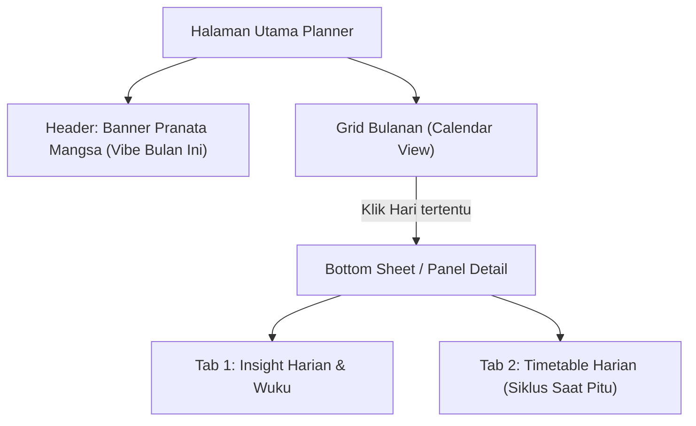

# PRD & Rencana Desain: Integrasi Kalender & Timetable Astrologi (Aestral Planner)

## 1. Visi Produk: "Google Calendar untuk Astrologi Nusantara"
Menghadirkan fitur **Astrological Planner** interaktif berupa kalender bulanan terpadu (*timetable*) yang menerjemahkan 4 tingkat waktu astrologi Jawa ke dalam panduan aktivitas produktivitas harian pengguna premium:
1.  **Bulanan / Musiman (Pranata Mangsa):** Tema besar/energi makro penataan hidup.
2.  **Mingguan (Wuku):** Peringatan/pantangan aktivitas dan pembobotan elemen.
3.  **Harian (Petungan Hari):** Kualitas hari personal (Sandang, Pangan, Gedhong, Loro, Pati).
4.  **Hourly (Saat Pitu / Jam Harian):** Panduan waktu mikro (*timetable*) untuk penjadwalan aktivitas spesifik (Negosiasi, Istirahat, Rapat, Eksekusi).

Dengan fitur ini, pengguna tidak hanya membaca ramalan statis, melainkan dapat **merencanakan jadwal harian mereka secara taktis** berdasarkan waktu terbaik (*Saat Rahayu*) dan menghindari waktu rawan (*Saat Naas*).

---

## 2. Arsitektur Data & Aliran API

Untuk meminimalkan latensi dan menjaga prinsip *Zero-Budget*, seluruh kalkulasi matematika berbasis tanggal (JDN) diproses di **Cloudflare Workers**, kemudian hasilnya dikirim sebagai satu payload bulanan agar Flutter dapat merendernya secara instan tanpa berulang kali melakukan request.

### A. Endpoint Usulan: `POST /api/calendar/month`
*   **Request Payload:**
    ```json
    {
      "birthDate": "1995-10-25",
      "targetYear": 2026,
      "targetMonth": 7
    }
    ```
*   **Response Payload Schema (Merged Output):**
    ```json
    {
      "target_year": 2026,
      "target_month": 7,
      "pranata_mangsa": {
        "id": 1,
        "nama_mangsa": "Kasa",
        "candra": "Sotya murca saking embanan",
        "tema_makro": "Ego-Death & Decluttering"
      },
      "days": [
        {
          "date": "2026-07-02",
          "weton_hari_ini": "Kamis Pon",
          "wuku": "Sinta",
          "neptu": 15,
          "pancasuda": {
            "sisa_bagi": 0,
            "fase": "Pati",
            "tingkat_energi": "Waspada",
            "vibe_warna": "purple",
            "saran_singkat": "Fase pelepasan ego. Hindari keputusan krusial hari ini."
          },
          "timetable": {
            "jam_baik": [
              {
                "range": "06:00 - 08:24",
                "label": "Saat Rezeki",
                "rekomendasi": "Sangat baik untuk rapat awal, presentasi ide, dan transaksi bisnis."
              },
              {
                "range": "13:12 - 15:36",
                "label": "Saat Gedhong",
                "rekomendasi": "Waktu terbaik untuk menandatangani kontrak atau menata aset keuangan."
              }
            ],
            "jam_naas": [
              {
                "range": "10:48 - 13:12",
                "label": "Saat Loro",
                "rekomendasi": "Fase energi waspada. Cocok untuk istirahat makan siang tenang, hindari perdebatan."
              },
              {
                "range": "15:36 - 18:00",
                "label": "Saat Pati",
                "rekomendasi": "Fase pembersihan. Gunakan untuk evaluasi kerja mandiri, hindari peluncuran produk."
              }
            ]
          }
        }
      ]
    }
    ```

---

## 3. Desain UI/UX: Terintegrasi Kalender & Timetable (Flutter)

Aestral akan menggunakan desain visual premium dengan palet warna yang menenangkan (tidak kaku/klenik) dan berfokus pada fungsionalitas perencana harian (*Daily Planner*).



### A. Tampilan Kalender Bulanan (Calendar View)
*   **Header Musiman:** Di bagian atas kalender, terdapat *card banner* artistik bergradasi dinamis yang menunjukkan Pranata Mangsa yang aktif (misal: *Banner biru kabut/dingin untuk Mangsa Kapitu*).
*   **Grid Hari (Day Tiles):**
    *   Setiap kotak tanggal menampilkan nomor hari masehi dan tulisan pasaran kecil di bawahnya (e.g., *2 | Kliwon*).
    *   **Indikator Warna Pancasuda:** Setiap tanggal dilingkari atau diberi titik warna halus berdasarkan status Petungan Hari pengguna:
        *   🟢 **Hijau (Pangan):** Hari Produktif / Ekspansi.
        *   🟡 **Emas (Gedhong):** Hari Investasi / Material.
        *   🔵 **Biru (Sandang):** Hari Branding / Sosial.
        *   🟠 **Oranye (Loro):** Hari Recharging / Batasan Diri.
        *   🟣 **Ungu/Abu (Pati):** Hari Refleksi / Rileksasi Ego.

### B. Tampilan Detail Jam (Timetable / Timeline View)
Saat pengguna mengetuk salah satu tanggal di kalender, lembar detail (*bottom sheet*) akan bergeser ke atas untuk menampilkan **Jadwal Jam Astrologi**:
*   **Format Timeline Vertikal:** Layout seperti agenda harian dari jam 06:00 pagi hingga 18:00 sore.
*   **Visual Jam Baik vs Jam Naas:**
    *   Slot jam baik (e.g., *Saat Rezeki*) berwarna latar hijau/emas lembut dengan ikon *checklist* interaktif (To-Do list harian).
    *   Slot jam rawan (e.g., *Saat Loro*) berwarna latar oranye/abu lembut dengan pengingat ramah untuk melambatkan ritme kerja.
*   **Interactive Checklist:** Saran aktivitas pada jam tersebut dikemas menjadi To-Do list interaktif yang bisa dicentang pengguna setelah diselesaikan.
*   **Tombol Add to Calendar (Google/Apple):** Pengguna premium dapat mengeklik tombol ekspor di slot jam baik tertentu untuk membuat pengingat rapat di kalender bawaan ponsel mereka secara otomatis.

---

## 4. Logika Perhitungan Jam (Saat Pitu / Jam Jawa)

Backend di Cloudflare Worker (`weton.ts`) saat ini sudah memiliki mesin perhitungan `getJamInsight(saptawaraName)` yang memetakan jam baik/buruk harian berdasarkan nama hari Saptawara. 

### Alur Sinkronisasi Jam di Backend:
1.  **Terima Input:** Backend menerima tanggal target dan weton kelahiran.
2.  **Hitung Hari:** Konversi tanggal target menjadi weton hari bersangkutan (e.g. Senin Pahing).
3.  **Tarik Data Jam:** Panggil `getJamInsight("Senin")` untuk mendapatkan daftar jam baik dan naas yang sesuai dengan Saptawara hari tersebut.
4.  **Enkapsulasi:** Satukan data tersebut ke dalam array `days` bulanan untuk dikirim ke klien.

---

## 5. Rencana Penahapan & Checkpoint

Untuk menguji kelayakan fitur ini tanpa merusak kode utama yang stabil, kita akan membagi pengembangannya ke dalam beberapa checkpoint terstruktur (di roomchat berikutnya yang mengizinkan modifikasi kode):

*   **Fase 1: Backend API Upgrade (Cloudflare Workers)**
    *   Membuat endpoint `POST /api/calendar/month`.
    *   Menyatukan output dari `weton.ts` (Pranata Mangsa, Wuku, Petungan Hari, Jam Insight) menjadi payload berstruktur kalender.
    *   Menulis uji integrasi API bulanan via Vitest.
*   **Fase 2: UI Foundation & Calendar Grid (Flutter)**
    *   Membangun komponen `AstrologicalCalendarGrid` menggunakan paket kalender Flutter yang efisien (seperti `table_calendar` or custom grid).
    *   Menghubungkan status hari ke indikator warna Pancasuda.
*   **Fase 3: Detail Bottom Sheet & Timetable (Flutter)**
    *   Membuat tampilan detail vertikal timeline berdasarkan respon data `timetable` jam baik/naas.
    *   Mengintegrasikan Interactive To-Do List lokal menggunakan SharedPreferences untuk menyimpan status centang pengguna.
